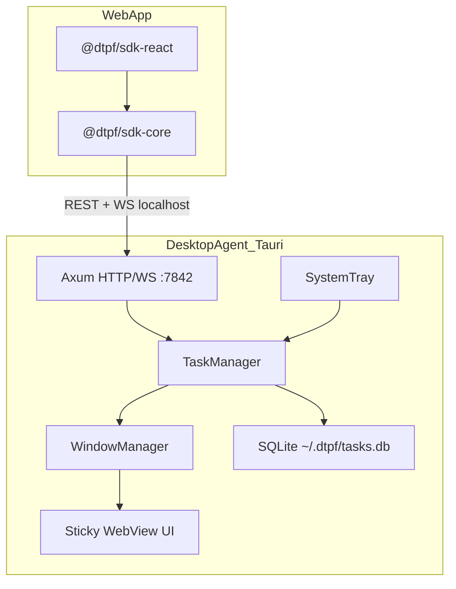

# DTPF Phase 1 MVP Implementation Plan

## Current State

The workspace contains only [`desktop-task-presence-framework.md`](desktop-task-presence-framework.md) — no code yet. Section 11 ("Cursor AI Execution Plan") defines the build order; this plan adapts it to **Phase 1 MVP** with **Windows + Linux** as first-class targets.

## MVP Definition of Done

A developer can:

1. Install and run the **DTPF Agent** (system tray, auto-starts optionally)
2. `pnpm add @dtpf/sdk-react` in a web app, wrap with `<DTPFProvider>`, call `createStickyTask()`
3. See a native always-on-top sticky on desktop; update/complete/dismiss syncs back via WebSocket
4. Stickies survive agent restart (SQLite persistence + window restore)

**In scope (from doc Section 3 Phase 1 P0):** sticky notes, always-on-top, task CRUD, system tray, WebSocket real-time updates, offline-local SQLite, auto-start (Win + Linux), basic multi-monitor fallback, OS notifications for reminders.

**Deferred to Phase 2:** macOS support, SQLCipher encryption (use plain SQLite for MVP), cloud sync, auto-updater, Sentry, Docusaurus docs site, `sdk-vanilla`, NestJS cloud API, dark mode polish (basic `prefers-color-scheme` in sticky UI is fine).

## Architecture



**Local protocol** (from doc Section 2.4):
- REST `127.0.0.1:7842` — task CRUD, auth registration
- WebSocket `ws://127.0.0.1:7842/ws` — bidirectional events (`task:updated`, `task:dismissed`, etc.)
- Discovery — probe ports `[7842, 7843, 7844]` + optional `~/.dtpf/agent.lock`

## Target Monorepo Layout

```
DTPF/
├── apps/desktop-agent/          # Tauri v2 + Axum + sticky UI
├── packages/
│   ├── shared-types/            # @dtpf/shared-types
│   ├── sdk-core/                # @dtpf/sdk-core
│   ├── sdk-react/               # @dtpf/sdk-react
│   └── eslint-config/
├── examples/react-basic/        # Minimal demo (faster than Next.js for MVP)
├── turbo.json
├── pnpm-workspace.yaml
├── tsconfig.base.json
└── README.md
```

Skip `apps/cloud-api/` and `apps/docs/` for MVP.

## Implementation Sequence

### Step 1 — Monorepo Foundation (Epic 1)

Initialize Turborepo + pnpm workspaces per doc Section 5:

- Root: `turbo.json` pipelines (`build`, `dev`, `lint`, `test`), `pnpm-workspace.yaml`, shared `tsconfig.base.json`, `.gitignore` (Node + Rust + Tauri artifacts)
- Packages: `@dtpf/eslint-config`, `@dtpf/shared-types` with interfaces from doc Section 6.1 (`Task`, `CreateTaskOptions`, `TaskEvent`, `DTPFConfig`, etc.)
- Build shared-types with **tsup** (ESM + CJS exports)

### Step 2 — Desktop Agent Scaffold (Epic 2.1)

In `apps/desktop-agent/`:

- `cargo tauri init` (Tauri v2)
- `tauri.conf.json`: `productName: DTPF Agent`, `identifier: com.dtpf.agent`, hidden main window, system tray enabled
- Rust module tree from doc Section 5:

```
src-tauri/src/
  main.rs              # bootstrap, spawn Axum, tray, restore windows
  commands/{task,window}.rs
  server/{mod,routes,websocket,auth}.rs
  db/{mod,repository}.rs + migrations/
  tray/mod.rs
  window_manager/mod.rs
  sync/mod.rs          # stub for Phase 2
```

**Key dependencies:** `tauri 2`, `axum 0.7`, `tokio`, `sqlx` (sqlite), `serde`, `uuid`, `hmac`, `sha2`, `tower`, `tower-governor`

### Step 3 — SQLite Persistence (Epic 2.2)

- Migration `0001_initial.sql` — schema from doc Section 2.5 (`tasks`, `app_registrations`)
- `Database` struct wrapping `sqlx::SqlitePool`; DB path `~/.dtpf/tasks.db`
- Repository functions: `create_task`, `get_task`, `list_active_tasks`, `update_task`, `delete_task`, `update_position`, `register_app`, `get_app_by_id`
- **MVP simplification:** skip SQLCipher; add a `// TODO Phase 2: SQLCipher` note in `db/mod.rs`

### Step 4 — Axum HTTP/WS Server (Epic 2.3 + 5.1)

Bind exclusively to `127.0.0.1:7842`:

| Method | Route | Purpose |
|--------|-------|---------|
| GET | `/health` | Agent discovery (no auth) |
| POST | `/auth/register` | First-time app approval + token |
| GET/POST | `/tasks` | List / create |
| GET/PUT/DELETE | `/tasks/:id` | Read / update / delete |
| POST | `/tasks/:id/complete` | Complete task |
| POST | `/tasks/:id/snooze` | Snooze task |
| GET | `/ws` | WebSocket upgrade |

Auth middleware (doc Section 8.2):
- Localhost IP only (`127.0.0.1` / `::1`)
- `Authorization: Bearer <token>` + `X-DTPF-App-ID`
- Origin header matches registered origin
- Rate limit: 100 req/min per `app_id` via `tower-governor`

Registration flow: Tauri native dialog → HMAC-SHA256 token stored in DB; secret in OS keychain where feasible (Linux: file fallback under `~/.dtpf/` for MVP if keychain crate is painful).

Start Axum in a **separate Tokio task** from `main.rs` so tray + server run concurrently.

### Step 5 — Window Manager + Tray (Epic 2.4 + 7.1–7.3)

**Window manager** (`window_manager/mod.rs`):
- `create_sticky_window` — doc Section 7.2 properties (280×200, frameless, always-on-top, transparent, skip taskbar)
- `destroy_sticky_window`, `restore_all_windows` on startup
- `update_sticky_content` via `app.emit_to()` / Tauri events
- `save_window_position` Tauri command → DB update on drag-end

**Multi-monitor (basic):** store `monitor_id`; on restore, if monitor missing → place on primary monitor with offset cascade (`100 + index*20`).

**System tray:** active task count, show/hide all stickies, connected apps list, quit. Use Tauri v2 tray APIs.

**Platform auto-start (Win + Linux only):**
- Windows: HKCU Run registry key (doc Section 7.4)
- Linux: systemd user unit at `~/.config/systemd/user/dtpf-agent.service`
- macOS: stub with `#[cfg(target_os = "macos")]` TODO

**Reminders:** background Tokio task polling `remind_at`; fire OS notification via Tauri notification plugin (`notify-rust` on Linux, Windows toast API).

### Step 6 — Sticky Note WebView UI (Epic 3)

`apps/desktop-agent/ui/sticky-note/` — Vite + React + Tailwind:

- Read `taskId` from URL query param
- `invoke('get_task')` on mount; `listen('task:updated')` for live updates
- UI: drag handle, title, body, priority dot, source app badge, Complete/Dismiss buttons
- `invoke('save_window_position')` on drag-end
- Background color from `task.color` (default `#FFE066`); transparent window, rounded card

Wire UI into Tauri build (`beforeBuildCommand` / `devUrl` in `tauri.conf.json`).

### Step 7 — Frontend SDK (Epic 4)

**`@dtpf/sdk-core`** — `DTPFClient` per doc Section 6.2:
- `discovery.ts` — port probe with 500ms timeout
- `http-client.ts` — fetch REST with auth headers
- `ws-client.ts` — WebSocket with exponential backoff reconnect (max 30s)
- `auth.ts` — token in `localStorage` key `dtpf_token_{appId}`; `/auth/register` on first connect
- Error types: `AGENT_NOT_FOUND`, `AUTH_FAILED`, `RATE_LIMITED`, `TASK_NOT_FOUND`, `NETWORK_ERROR`

**`@dtpf/sdk-react`**:
- `DTPFProvider` — init client, `connect()` on mount, context `{ client, status, isConnected }`
- `useStickyTask`, `useTaskEvents`, `useAgentStatus` (30s poll)

Build both with tsup (ESM + CJS); workspace deps on `@dtpf/shared-types`.

### Step 8 — Demo App (Epic 7, simplified)

`examples/react-basic/` (Vite + React, not Next.js — fewer moving parts for MVP):

- Dashboard with sample tasks + "Accept Task" → `createStickyTask()`
- Agent status indicator + banner when disconnected
- Toast on successful sticky creation
- Uses Tailwind; shadcn/ui optional if time permits

### Step 9 — Basic CI (Epic 6.1, trimmed)

`.github/workflows/ci.yml`:
- **Job 1:** `pnpm install` → `turbo run lint test build` (SDK packages)
- **Job 2:** `cargo test` in `apps/desktop-agent/src-tauri` on `ubuntu-latest` + `windows-latest`
- Skip signed release workflow until Phase 2

## Platform Notes (Windows + Linux)

| Feature | Windows | Linux |
|---------|---------|-------|
| Always-on-top | Tauri `always_on_top(true)` | Same; may need compositor (Picom) for transparency |
| Tray | Win32 system tray | `libappindicator` / GTK — verify Tauri v2 tray on your distro |
| Notifications | Windows toast | `notify-rust` |
| Auto-start | Registry Run key | systemd user service |
| Dev env | WebView2 (preinstalled on Win11) | `webkit2gtk` dev packages required |

Test sticky creation end-to-end on **both** platforms before calling MVP done.

## Risk Mitigations

- **Tauri + Axum in same process:** spawn Axum before `tauri::Builder::run()`; share `Database` via `Arc` + Tauri `manage()`
- **CORS from browser:** agent must validate `Origin` against registered app origins (typically `http://localhost:5173` for demo)
- **Linux transparency:** document compositor requirement in README; graceful degradation if transparency fails
- **sqlx compile-time queries:** run `cargo sqlx prepare` in CI or use runtime queries for faster initial iteration

## Suggested Build Order (2-week cadence)

| Days | Deliverable |
|------|-------------|
| 1–2 | Monorepo + shared-types + Tauri scaffold + SQLite migrations |
| 3–4 | Axum routes + auth + window manager + tray shell |
| 5–6 | Sticky note UI + position persistence + window restore |
| 7–8 | sdk-core + sdk-react + discovery + WebSocket events |
| 9–10 | Demo app + Win/Linux auto-start + reminder notifications |
| 11–12 | CI pipeline + README quick start + cross-platform smoke test |

## Key Reference Snippets

Shared types anchor ([`desktop-task-presence-framework.md`](desktop-task-presence-framework.md) Section 6.1):

```typescript
export interface DTPFConfig {
  appId: string;
  appName: string;
  token?: string;
  timeout?: number;
}
```

Window creation anchor (Section 7.2):

```rust
.decorations(false)
.always_on_top(true)
.skip_taskbar(true)
.transparent(true)
.inner_size(280.0, 200.0)
```

SDK entry point (Section 6.2):

```typescript
async createStickyTask(options: CreateTaskOptions): Promise<Task>
async subscribeTaskEvents(handler: (event: TaskEvent) => void): Unsubscribe
```
